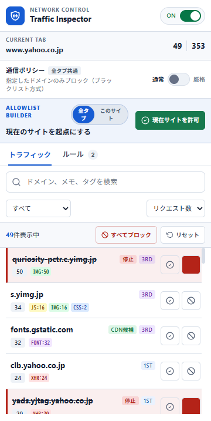
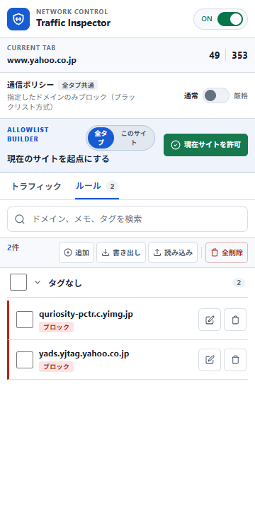

# Domain Traffic Inspector

Chromeのサイドパネルで、現在のタブから発生する通信をドメイン別に確認し、通信ルールを管理するManifest V3拡張機能です。計測データとルールは端末内で処理され、開発者のサーバーへ送信されません。Web開発時の依存先監査、プライバシー調査、壊れたサイトの原因切り分けに向いています。


## 主な機能

- ドメイン別のリクエスト数とリソース種別のリアルタイム表示
- 個別ブロックと、許可リスト方式で全ドメインを既定ブロックする厳格モード
- 閲覧サイトごとに独立した「サイト保護」と、依存先の5分間一時許可
- 親ドメインの方針を継承し、より具体的なサブドメインで上書きできる階層ルール
- メモ・タグ付きルール管理、検索、一括操作、JSONインポート／エクスポート

## インストール

Chrome 114以降が必要です。

1. [最新リリース](https://github.com/kuronekorou39/chrome-domain-traffic-inspector/releases/latest)の「Assets」欄から `domain-traffic-inspector-v○.○.○.zip` をダウンロードし、任意の場所に展開します。展開したフォルダーが拡張機能の本体になるため、インストール後も残しておいてください。
2. Chromeで `chrome://extensions` を開き、右上の「デベロッパーモード」をオンにします。
3. 「パッケージ化されていない拡張機能を読み込む」から、展開したフォルダーを選びます。
4. ツールバーのアイコンからサイドパネルを開きます。

開発版を使う場合は、リポジトリをクローンして同じ手順でルートフォルダーを読み込みます。

## 使い方

対象ページを開くと、サイドパネルに通信先ドメインが一覧表示され、行ごとに許可／ブロックを切り替えられます。厳格モードでは許可したドメイン以外の通信を停止し、「サイト保護」では閲覧サイト単位で未登録の外部通信だけを止められます。詳しい手順は[使い方ガイド](docs/USAGE.md)を参照してください。

<p>
  
  
</p>

## 権限

- `webRequest` / `<all_urls>`: 通信先ドメインとリソース種別を端末内でタブ別に集計するため
- `declarativeNetRequest`: 指定されたドメインをブロックするため
- `alarms`: 5分間の一時許可を、サイドパネルを閉じた後も期限どおり解除するため
- `storage`: ルールと設定を端末内に保存するため
- `sidePanel`: UIをChromeサイドパネルに表示するため

詳細は[プライバシーポリシー](PRIVACY.md)を参照してください。

## 開発

```sh
npm ci
npm run lint
npm test
```

参加方法は[CONTRIBUTING.md](CONTRIBUTING.md)、脆弱性の報告は[Security Policy](SECURITY.md)を参照してください。`manifest.json`と`package.json`のバージョンを一致させ、`v1.1.0`のようなタグをpushするとリリース用ZIPが自動生成されます。

## License

[ISC License](LICENSE)
